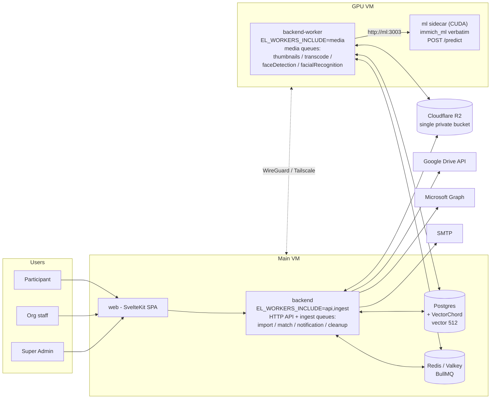

# 00 — Overview

> **EventLens** (working codename — rename freely) is a standalone **event media management platform** derived from [Immich](https://immich.app). Immich source is referenced throughout this document set as `immich:server/src/...`, meaning a path inside the read-only reference checkout at `C:\Projects\immich`. **Immich is never modified; code is copied out of it.**

## 1. Product concept

| Actor | What they do |
|---|---|
| **Super Admin** | Creates and manages **Organizations**; platform-level dashboards (queue health, storage, org stats). |
| **Organization** (owner / admin / member) | Creates **Events**; uploads event photos & videos three ways — **manual browser upload**, **Google Drive folder import (OAuth)**, **OneDrive folder import (OAuth)**; reviews detected people clusters; monitors participants. |
| **Participant** | Opens the public event link `/e/{slug}`, submits **email + selfie**. Their selfie is face-matched against every face detected in the event's media. They receive an **email with a secure tokenized personal gallery link** (`/g/{token}`) showing all photos they appear in — viewable and downloadable, and it keeps updating as more event media is processed. |

Media processing uses **Immich's exact facial classification pipeline**: RetinaFace face detection + ArcFace 512-dimension embeddings (the Python `immich_ml` FastAPI service, copied verbatim), cosine-KNN vector search in Postgres, and the same clustering algorithm that groups faces into persons.

## 2. System at a glance

- The **backend** and **backend-worker** are the *same NestJS codebase* deployed in two roles (Immich's own `IMMICH_WORKERS_INCLUDE` pattern, ported as `EL_WORKERS_INCLUDE`). They communicate **only through Redis (BullMQ jobs) and Postgres** — no direct RPC. See [01-architecture.md](01-architecture.md).
- The GPU worker downloads originals from R2, does all heavy processing locally (sharp / ffmpeg / ML sidecar), and **writes derivatives back to R2** — exactly the "process and store back to storage" requirement.
- Job payloads carry **IDs only, never bytes**.

## 3. Stack

| Layer | Choice | Notes |
|---|---|---|
| API + worker | **NestJS 11 + TypeScript + Kysely** | Same as Immich server; ported subsystems compile with minimal change. |
| Queue | **BullMQ on Redis (Valkey)** | Bull prefix `el_bull`. |
| Database | **Postgres via `ghcr.io/immich-app/postgres`** (pgvector + VectorChord preinstalled) | `face_search.embedding vector(512)`, VectorChord cosine index. |
| ML | **`immich_ml` Python FastAPI service, copied verbatim**, built with `DEVICE=cuda` | RetinaFace + ArcFace (`buffalo_l`), ONNX Runtime CUDA. |
| Media storage | **Cloudflare R2** (S3-compatible), single private bucket | Presigned GETs for serving; zero egress fees. |
| Web | **SvelteKit 2 / Svelte 5 static SPA**, Tailwind v4 + `@immich/ui` | Immich theme verbatim. |
| Email | **nodemailer + react-email** (Immich pipeline) | Gallery-ready / digest / no-face templates. |

## 4. Decisions log (settled — do not re-open)

| # | Decision | Rationale |
|---|---|---|
| D1 | **Selective port, not full fork.** New clean monorepo; copy the ML service verbatim and port proven server/web subsystems. | Retrofitting R2 + org/event multi-tenancy into all of Immich (60+ tables, sync/audit machinery, albums/memories/CLIP/OCR) costs more than porting the ~15 subsystems we need. Confirmed by user. |
| D2 | **One backend codebase, two deployables** (`EL_WORKERS_INCLUDE=api,ingest` vs `media`). | Immich's `@OnJob` registry validates at startup that every job has a handler (`immich:server/src/repositories/job.repository.ts`); splitting codebases would split the registry. Role-gated queue startup is the proven pattern. |
| D3 | **All heavy media processing on the GPU worker** (thumbnails, transcode, face detect/embed, clustering). | Keeps API VM light; matches the user's "worker processes images and stores them back". Confirmed by user. |
| D4 | **ML runs as an HTTP sidecar** next to the worker on the GPU VM, not merged into a Python queue consumer. | Zero-diff copy of `immich_ml`; reuses `machine-learning.repository.ts` client verbatim; BullMQ's Python client lacks parity with Node. |
| D5 | **Through-API upload** (multipart to backend), not browser→R2 presigned PUT. | Preserves Immich's trusted inline-SHA-1 dedupe + bulk-upload-check preflight; no R2 CORS/credential surface. See [04-storage-r2.md](04-storage-r2.md). |
| D6 | **Face-level participant matching** — selfie embedding KNN directly against `face_search`, not cluster membership. | Immich's `minFaces: 3` means guests appearing in 1–2 photos never form a cluster; face-level matching still finds them. Clustering still runs for the org-facing People UI. See [07-participant-flow.md](07-participant-flow.md). |
| D7 | **VectorChord** vector index (Immich's Postgres image). | The ported `searchFaces` SQL sets `vchordrq.probes` verbatim. pgvector-HNSW fallback documented in [03-database-schema.md](03-database-schema.md). |
| D8 | **Gallery-link email** (tokenized personal gallery), not photo attachments. | Attachment size limits break at event scale; gallery auto-updates. Confirmed by user. |
| D9 | **OAuth connect** for Drive/OneDrive import (not public-link paste). | Works with private folders; server-side resumable import. Confirmed by user. |
| D10 | **Persons and matching are event-scoped**, never cross-event. | Privacy requirement: the same human at two events is two unrelated `person` rows. Enforced in every ported face query (`ownerId` → `eventId`); mandated integration test. |

## 5. Requirements traceability

| Requirement (user's words) | Where designed |
|---|---|
| Super Admin creates/manages organizations | [03-database-schema.md](03-database-schema.md) (`user.is_super_admin`, `organization`), [09-api-surface.md](09-api-surface.md) §Super-admin, [10-web-app.md](10-web-app.md) `/admin` |
| Organizations create events, upload media | [03](03-database-schema.md) (`event`, `asset`), [09](09-api-surface.md) §Org, [10](10-web-app.md) `/events` |
| Process uploaded photos & store them | [05-job-orchestration.md](05-job-orchestration.md) upload pipeline, [04-storage-r2.md](04-storage-r2.md) derivatives |
| Exact same facial classification logic | [06-face-pipeline.md](06-face-pipeline.md) (verbatim `immich_ml` + ported detect/cluster services) |
| Participant link → selfie upload → profile emailed | [07-participant-flow.md](07-participant-flow.md) (`/e/{slug}`, `/g/{token}`, email cadence) |
| Same design as Immich | [10-web-app.md](10-web-app.md) (theme + `@immich/ui` verbatim) |
| Separate app; copy, don't modify Immich | [02-monorepo-and-code-reuse.md](02-monorepo-and-code-reuse.md) copy map |
| backend vs backend-worker (GPU VM) | [01-architecture.md](01-architecture.md), [05](05-job-orchestration.md), [11-deployment.md](11-deployment.md) |
| Postgres, Redis | [03](03-database-schema.md), [05](05-job-orchestration.md) |
| Cloudflare R2 for images | [04-storage-r2.md](04-storage-r2.md) |
| Google Drive / OneDrive / manual upload | [08-cloud-imports.md](08-cloud-imports.md), [04](04-storage-r2.md) §upload |

## 6. Reading order

[README.md](README.md) lists all documents. Suggested order: 00 → 01 → 02 → 03 → 05 → 04 → 06 → 07 → 08 → 09 → 10 → 11 → 12.
