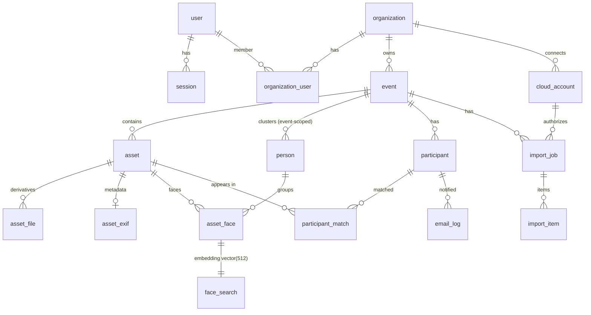

# 03 — Database Schema

Postgres via **`ghcr.io/immich-app/postgres`** (Immich's image: Postgres with pgvector + VectorChord preinstalled and preconfigured; currently pinned to `14-vectorchord0.4.3-pgvectors0.2.0` in `immich:docker/docker-compose.yml`). Query layer: **Kysely** with hand-written TypeScript migrations (we drop Immich's decorator-schema→SQL generator — overkill for a fresh schema — but keep Kysely so ported repositories compile with minimal change).

Naming: singular table names, snake_case columns — matching Immich conventions where code is ported. `asset_face` and `face_search` are **column-identical to Immich** so ported SQL runs unchanged.

## 1. Entity relationship overview

## 2. Tables

### Identity & tenancy

**`user`** — platform accounts (super admins + org staff).
`id uuid pk`, `email citext unique`, `password varchar` (bcrypt), `name varchar`, `is_super_admin bool default false`, `created_at`, `updated_at`, `deleted_at`.

**`session`** — port of Immich `session` (`immich:server/src/schema/tables/`, handling in `auth.service.ts`).
`id uuid pk`, `user_id fk→user cascade`, `token bytea` (SHA-256 of the raw 32-byte token; raw shown once), `device_os varchar`, `device_type varchar`, `expires_at timestamptz`, `created_at`, `updated_at`. Index on `token`.

**`organization`**
`id uuid pk`, `name varchar`, `slug varchar unique`, `status varchar check in ('active','suspended') default 'active'`, `created_by fk→user`, `created_at`, `updated_at`, `deleted_at`.

**`organization_user`**
`org_id fk→organization cascade`, `user_id fk→user cascade`, `role varchar check in ('owner','admin','member')`, `created_at`, `pk(org_id, user_id)`.

**`event`**
`id uuid pk`, `org_id fk→organization cascade`, `name varchar`, `slug varchar unique` (public participant link `/e/{slug}`), `description text`, `starts_at timestamptz`, `ends_at timestamptz`, `status varchar check in ('draft','active','closed') default 'draft'`, `participant_page_enabled bool default true`, `config jsonb default '{}'` (per-event overrides: `matchMaxDistance`, `minScore`), `created_at`, `updated_at`, `deleted_at`.

### Media

**`asset`**
`id uuid pk`, `event_id fk→event cascade`, `org_id fk→organization` (denormalized — org-level queries/deletes without joins), `type varchar check in ('image','video')`, `original_filename varchar`, `checksum bytea` (SHA-1), `file_size bigint`, `mime_type varchar`, `width int`, `height int`, `duration_seconds real` (video), `status varchar check in ('staged','stored','processed','failed') default 'staged'`, `source varchar check in ('upload','gdrive','onedrive')`, `storage_key text` (R2 key of the original), `thumbhash bytea`, `captured_at timestamptz` (EXIF), `created_at`, `deleted_at`.
Constraints/indexes: **`unique (event_id, checksum) where deleted_at is null`** — the dedupe constraint (Immich's `(ownerId, checksum)` pattern from `immich:server/src/services/asset-media.service.ts`; violation is caught and answered with `status: 'duplicate'`, detection helper ported from `immich:server/src/utils/database.ts`). Indexes: `(event_id, captured_at desc)`, `(org_id)`.

**`asset_file`** — derivative registry (Immich `asset_file` with `path` → `storage_key`).
`id uuid pk`, `asset_id fk→asset cascade`, `type varchar check in ('preview','thumbnail','encoded_video')`, `storage_key text`, `width int`, `height int`, `format varchar`, `file_size bigint`, `created_at`, `unique(asset_id, type)`.

**`asset_exif`** — slim metadata (via `exifr` for images + ffprobe for video; we do not port the full exiftool-vendored surface).
`asset_id uuid pk fk→asset cascade`, `captured_at timestamptz`, `make varchar`, `model varchar`, `orientation int`, `lens varchar`, `latitude double precision`, `longitude double precision`.

### Faces (column-identical to Immich)

**`asset_face`** — mirrors `immich:server/src/schema/tables/asset-face.table.ts`.
`id uuid pk`, `asset_id fk→asset cascade`, `person_id fk→person on delete set null` (nullable), `image_width int`, `image_height int`, `bounding_box_x1 int`, `bounding_box_y1 int`, `bounding_box_x2 int`, `bounding_box_y2 int`, `source_type varchar default 'machine-learning'`, `deleted_at`, `updated_at`.
Indexes: `(asset_id, person_id)`, `(person_id, asset_id)` partial where not deleted.

**`face_search`** — mirrors `immich:server/src/schema/tables/face-search.table.ts`.
`face_id uuid pk fk→asset_face cascade`, **`embedding vector(512)`**.
Index: `face_index` created via the ported `vectorIndexQuery` (`immich:server/src/utils/database.ts` ~line 498) — VectorChord `using vchordrq (embedding vector_cosine_ops)`.

**`person`** — event-scoped clusters (Immich `person` minus birthDate/favorites/color; **`owner_id` → `event_id`**).
`id uuid pk`, `event_id fk→event cascade`, `org_id fk→organization`, `name varchar default ''` (org-assigned label), `face_asset_face_id fk→asset_face on delete set null` (cover face), `thumbnail_key text default ''` (R2, 250 px crop), `is_hidden bool default false`, `created_at`, `updated_at`.
Index: `(event_id)`.

### Participants

**`participant`**
`id uuid pk`, `event_id fk→event cascade`, `email citext`, `selfie_key text` (R2), `selfie_embedding vector(512)` (nullable until processed), `gallery_token_hash bytea` (SHA-256; raw token only in the email link), `status varchar check in ('processing','no_face','pending_match','matched')`, `notified_first_at timestamptz`, `last_notified_at timestamptz`, `created_at`, `updated_at`, `deleted_at`.
Constraint: `unique(event_id, email)` — re-submission **upserts** (new selfie replaces old; token regenerated). Index on `gallery_token_hash`.

**`participant_match`** — face-level match results; **the participant gallery reads from this table** (Decision D6).
`participant_id fk→participant cascade`, `asset_id fk→asset cascade`, `via_face_id fk→asset_face`, `distance real`, `created_at`, `pk(participant_id, asset_id)`.
Inserts are `on conflict do nothing` → rematch is idempotent.

### Imports

**`cloud_account`**
`id uuid pk`, `org_id fk→organization cascade`, `provider varchar check in ('gdrive','onedrive')`, `account_email citext`, `refresh_token_enc bytea`, `access_token_enc bytea`, `token_expires_at timestamptz`, `scopes text[]`, `created_by fk→user`, `created_at`, `revoked_at`, `unique(org_id, provider, account_email)`.
Tokens encrypted **AES-256-GCM** with `EL_TOKEN_ENCRYPTION_KEY` (32 bytes); stored as `iv || auth_tag || ciphertext`, random IV per value.

**`import_job`**
`id uuid pk`, `event_id fk→event cascade`, `org_id`, `cloud_account_id fk→cloud_account`, `provider varchar`, `folder_remote_id varchar`, `folder_name varchar`, `recursive bool default true`, `status varchar check in ('listing','importing','done','failed','cancelled')`, `total_files int default 0`, `done_files int default 0`, `skipped_files int default 0`, `failed_files int default 0`, `error text`, `created_by fk→user`, `created_at`, `finished_at`.

**`import_item`**
`id uuid pk`, `import_job_id fk→import_job cascade`, `event_id uuid` (denormalized), `provider varchar`, `remote_id varchar`, `remote_name varchar`, `remote_size bigint`, `remote_checksum varchar` (Drive md5Checksum / Graph sha1Hash-or-quickXorHash), `status varchar check in ('pending','downloading','done','skipped_duplicate','failed')`, `asset_id fk→asset` (nullable), `error text`, `created_at`, `updated_at`.
Constraint: **`unique(event_id, provider, remote_id)`** — drives incremental re-sync ([08-cloud-imports.md](08-cloud-imports.md)).

### Operations

**`email_log`**
`id uuid pk`, `event_id`, `participant_id fk→participant`, `to_email citext`, `template varchar`, `subject varchar`, `status varchar check in ('queued','sent','failed')`, `message_id varchar`, `error text`, `created_at`, `sent_at`.

**`system_config`** — Immich `system_metadata` pattern.
`key text pk`, `value jsonb`. Holds SMTP settings and global ML defaults (`facialRecognition: { modelName: 'buffalo_l', minScore: 0.7, maxDistance: 0.5, minFaces: 3 }` — same defaults as `immich:server/src/config.ts` ~line 310).

## 3. Multi-tenancy rules

1. Every event-owned row carries `event_id`; `asset` and `person` also carry denormalized `org_id`.
2. **Repository methods require scope**: `getAsset(eventId, assetId)`, never `getAsset(assetId)`. No unscoped by-id lookups anywhere.
3. Access resolution (slim port of the `immich:server/src/utils/access.ts` pattern): super admin → everything; org user → rows whose `org_id` is in their memberships (role gates writes: `member` uploads, `admin` manages event, `owner` manages members); participant token → only their own `participant` row and assets present in `participant_match`.
4. **Face KNN is scoped inside the SQL CTE** by `asset.event_id = :eventId` — cross-event matching is structurally impossible, not just filtered in application code. See [06-face-pipeline.md](06-face-pipeline.md).
5. Deletes cascade logically: event soft-delete → cleanup job removes R2 prefix + hard-deletes rows after grace period ([04-storage-r2.md](04-storage-r2.md) §6).

## 4. Vector index decision: VectorChord

**Chosen: VectorChord** (Immich's default since the `ghcr.io/immich-app/postgres` image ships it):

- The ported `searchFaces` executes `set local vchordrq.probes = …` unconditionally (`immich:server/src/repositories/search.repository.ts` ~line 322) — a verbatim port runs only on VectorChord.
- The index DDL comes from the ported `vectorIndexQuery` VectorChord branch, and `prewarm` (`vchordrq_prewarm('face_index')`, `immich:server/src/repositories/database.repository.ts`) copies unchanged.
- We control the database VM via docker-compose, so managed-Postgres compatibility is not a constraint.

**Documented fallback (pgvector HNSW)** if the deployment must ever move to managed Postgres without VectorChord:
1. Remove the `set local vchordrq.probes` statement and the `prewarm` call.
2. Create the index with the pgvector branch of `vectorIndexQuery`: `using hnsw (embedding vector_cosine_ops) with (ef_construction = 300, m = 16)`.
3. Nothing else changes — the `<=>` cosine operator and the CTE are identical. At event scale (10⁴–10⁵ faces per event) both perform comfortably.

## 5. Migration strategy

- Migrations are hand-written Kysely `.ts` files under `apps/backend/src/migrations/`, run at boot by a ported slim `runMigrations()` under a Postgres advisory lock (pattern: `immich:server/src/services/database.service.ts` `onBootstrap`, which runs migrations before anything else; `DB_SKIP_MIGRATIONS` escape hatch).
- Migration 0001 creates extensions (`uuid-ossp`, `citext`, `vchord` cascade → pgvector), all tables above, then the `face_index` via `vectorIndexQuery`.
- Kysely `DB` interface lives in `apps/backend/src/schema/` (pattern: `immich:server/src/schema/index.ts`).
